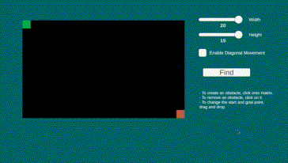

# A* Pathfinding Algorithm Interactive Visualization

  

## Manual

- To create an obstacle, click onto matrix.
- To remove an obstacle, click on it.
- To change the start and goal point, 
drag and drop.  

Playable both on Windows or directly on web! Windows build is in releases section. Web link is in about section.

